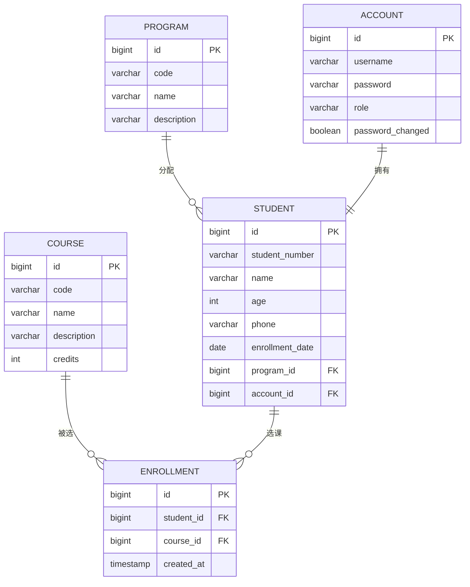

# 数据库模型图

```mermaid
erDiagram
    PROGRAM ||--o{ STUDENT : "分配"
    ACCOUNT ||--|| STUDENT : "拥有"
    COURSE ||--o{ ENROLLMENT : "被选"
    STUDENT ||--o{ ENROLLMENT : "选课"

    PROGRAM {
        bigint id PK
        varchar code
        varchar name
        varchar description
    }

    STUDENT {
        bigint id PK
        varchar student_number
        varchar name
        int age
        varchar phone
        date enrollment_date
        bigint program_id FK
        bigint account_id FK
    }

    ACCOUNT {
        bigint id PK
        varchar username
        varchar password
        varchar role
        boolean password_changed
    }

    COURSE {
        bigint id PK
        varchar code
        varchar name
        varchar description
        int credits
    }

    ENROLLMENT {
        bigint id PK
        bigint student_id FK
        bigint course_id FK
        timestamp created_at
    }
```
