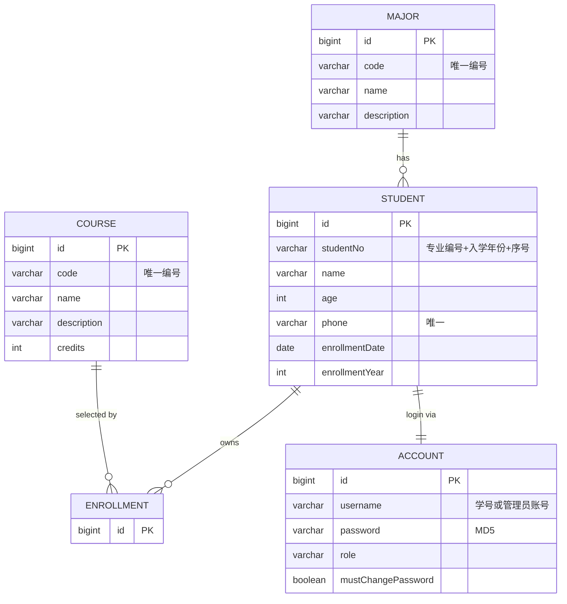

# 数据库模型图（Mermaid）

```mermaid
erDiagram
    MAJOR ||--o{ STUDENT : "has"
    COURSE ||--o{ ENROLLMENT : "selected by"
    STUDENT ||--o{ ENROLLMENT : "owns"
    STUDENT ||--|| ACCOUNT : "login via"

    MAJOR {
        bigint id PK
        varchar code "唯一编号"
        varchar name
        varchar description
    }
    COURSE {
        bigint id PK
        varchar code "唯一编号"
        varchar name
        varchar description
        int credits
    }
    ACCOUNT {
        bigint id PK
        varchar username "学号或管理员账号"
        varchar password "MD5"
        varchar role
        boolean mustChangePassword
    }
    STUDENT {
        bigint id PK
        varchar studentNo "专业编号+入学年份+序号"
        varchar name
        int age
        varchar phone "唯一"
        date enrollmentDate
        int enrollmentYear
    }
    ENROLLMENT {
        bigint id PK
    }
```
